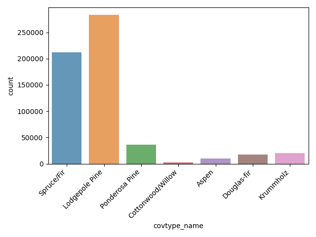
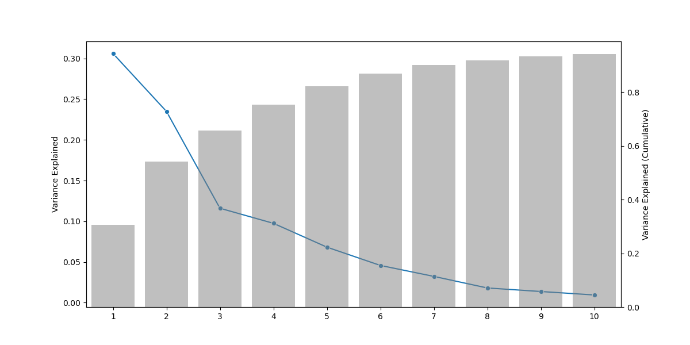

---
title: "AIML427 Big Data: Assignment 3"
author: [Devon Grossett]
date: "2024-06-11"
lang: "en"
...

# Using Spark Machine Learning Libraries on Covertype Dataset

## Introduction

For this project I have decided the use the 
[Covertype](https://archive.ics.uci.edu/dataset/31/covertype) dataset from the 
UCI Machine Learning Repository. Before processing, this dataset contains 54 
features and consists of approximately 500,000 observations. Each observation is
a 30 x 30m cell of forest in the Roosevelt National Forest of Northern Colorado.

The dataset contains cartographic information such as the cell elevation, slope 
(in degrees), aspect (compass direction of slope in degrees), horizontal and 
vertical distance to surface water features (in meters), horizontal distance to 
nearest roadway, horizontal distance to nearest wildfire ignition point, and the
hillshade index at 9am, noon, and 3pm at summer solstice, which is an index from
0 to 255 (with 0 being complete shade and 255 complete sun). All of these 
features are integers, and there are 10 of them in total.

As well as the cartographic variables, there are two categorical variables which
have come one-hot encoded. The first is `Wilderness_Area`, which has four levels
representing different wilderness areas (Rawah, Neota, Comanche Peak, and Cache 
la Poudre). The other is `Soil_Type` which has 40 levels representing different
soil families. Each soil family has a four digit USFS (United States Forestry
Service) Ecological Landtype Unit code. The first digit of this code represents
the climatic zone of the soil, and the second digit represents the geological 
zone. In total, there are 44 of the one-hot encoded variables derived from these
two categorical variables and they are all integer valued. Combined with the 10 
numeric features, this gives a total of 54 original features.

Lastly there is the target feature we are trying to predict the value of, which
is a categorical variable representing the forest cover type. It can take on one
of seven different values such as 'Spruce/Fir', 'Lodgepole Pine', 
'Cottonwood/Willow', etc. It is coded as an integer taking values from 1 to 7.

All of this information can be found in the `covtype.info` file that comes with 
the downloaded data, and the downloaded data is 75.2MB in size before any 
preprocessing.

In order to perform the task of predicting the forest cover type, we will be 
using the Python API for Apache Spark, PySpark. There are several options for
Multiclass classification in PySpark, but I have decided to use the 
`LogisticRegression` class of model from the `pyspark.ml.classification` 
library. This class of model supports multiclass classification through the use 
of a Multinomial Logit model (a Generalised Linear Model with a Multinomial 
distribution family, and a Softmax link function). For each observation, this 
model calculates a probability for each class, and classifies the observation 
belonging to the class with the largest predicted probability.

The distribution of class labels is shown in Figure 1. Here we can see that the
vast majority of our data falls into the first two class labels, having over 
200,000 observations each. The remaining all have 50,000 or fewer observations.

{ width=500px }

## Preprocessing

The first step in preprocessing was to select reference levels for the one-hot
encoded `Wilderness_Area` and `Soil_Type` variables. Without this step, the 
design matrix will be non-invertible and any attempt to find coefficients will
have trouble converging. For this analysis we just chose the first
variable of each (`Wilderness_Area_1` and `Soil_Type_1`) to be the reference
level and removed them from our dataset. This choice does not affect the model,
just how we interpret the coefficients.

We have also constructed the features `cos_aspect` and `sin_aspect` by 
converting `Aspect` to radians and taking the sine and cosine of this angle. 
This is due this feature representing the compass direction that the slope 
faces, so an aspect of 0&deg; and 360&deg; both represent exactly north. By 
taking the cosine, 0&deg; and 360&deg; both transform to 1.0, and `cos_aspect` 
represents "Northness" and avoids the issue of discontinuity highlighted above. 
Likewise for `sin_aspect`, except now 1 represents East and -1 West. 

Several interaction features were also constructed: `Slope` was interacted with
`Elevation`, `cos_aspect`, and `sin_aspect`, and each of the `Hillshade` 
features were interacted with each other.

After these steps were completed, there were 60 features in total and the data
was larger than 20MB in size.

Additionally, we wished to compare the performance of the Multinomial Logistic
Regression model with and without standardizing the features to have a mean of 
zero and a standard deviation of one. So an additional preprocessing step of 
standardizing the numeric features was done. The binary features weren't 
standardized, as they already fall in the range $[0, 1]$, and by standardizing 
we lose the useful interpretation of the coefficients being the average
difference in the linear predictor for that feature versus its reference level.

The final preprocessing was to reduce the original set of features down to a 
smaller number of principal components, to compare the model performance before 
and after performing this step. From Figure 2, we can see that by using the 
first 10 PC's of our data, we capture 94% of the variance of the original 
features. Hence this was chosen to be the number of principal components we 
used.

{ width=500px }

## Readme.txt

```
## Move Files to ECS System

Move multinomial_logistic_py, covtype.data, and SetupSparkClasspath.sh to 
barretts@ecs.vuw.ac.nz

$ scp multinomial_logistic.py <username>@barretts.ecs.vuw.ac.nz:
etc..


## Access VUW Hadoop cluster

ssh into barretts using your ecs account
$ ssh <username>@barretts.ecs.vuw.ac.nz 


ssh into one of the Hadoop nodes
$ ssh co246a-5
(last number can be 1-8)


## Setup Hadoop and Spark

configure Hadoop and Spark
$ source SetupSparkClasspath.sh

create directory for input and output datasets
$ hadoop fs -mkdir /user/<username>/input /user/<username>/output

upload input data into hdfs
$ hadoop fs -put covtype.data /user/<username>/input/


## Run Spark Job

multinomial_logistic.py takes 3 inputs:
    - path to input data
    - path to output folder
    - random seed

$ spark-submit --master yarn --deploy-mode cluster multinomial_logistic.py 
/user/<username>/input/covtype.data /user/grossedevo/output 200


## Retrieve Results

move from hdfs to ecs local
$ hadoop fs -copyToLocal /user/<username>/output
$ hadoop fs -rm -r /user/<username>/output

move from ECS system to desired path local pc
$ scp -r <username>@barretts.ecs.vuw.ac.nz:~/output ~/path/to/local
```

## Modelling Pseudo-code

```{.python}
if not enough arguments:
    exit

initialize spark session

data = read(csv file, column names)
drop = drop(reference levels of categorical features) from data

create unscaled features

test_data, train_data = 80:20 test train split of data

fit standard scaler on train data
transform test_data and train_data with standard scaler

fit pca model on train data
transform test data and train data with pca model

initialize F_1 evaluator

for each set of features:
    record start time
    fit logistic regression to unstandardized train_data
    record end time
    train_time = start_time - end_time

    train_preds = transform train_data with lr_model
    test_preds = transform test_data with lr_model

    train_f1 = evaluator(train_preds)
    test_f1 = evaluator(test_preds)

for each set of features:
    store train_f1, test_f1, train_time in dataframe
write results dataframe to storage

for each set of features:
    store model coefficients in dataframe
    write coefficients dataframe to disk

    store confusion matrices in dataframe
    write confusion matrices dataframe to disk

for pca model:
    store principal component weights in dataframe
    write principal component weights dataframe to disk

    store percent of variance explained to dataframe
    write percent of variance explained dataframe to disk

stop spark session 

```

## Comparing Unscaled and Scaled Model

Prior to finalising the model to be used for training, I performed some tests 
to determine if regularization would be beneficial for this problem. This was 
done via a grid search over `regParam` and `elasticNetParam` ($\lambda$ and 
$\alpha$, respectively). The results are shown in Figure 3, and suggest that 
the best performance is with either a very small $\lambda$, or $\lambda=0$. For
simplicity, we will use $\lambda=0$ i.e. no regularization.

{ width=300px }

For model evaluation, we use the test $F_1$ score, which balances recall and 
precision by taking their harmonic mean. Our data is split into 80% training, 
and 20% test.

With the model form now finalised, we compare the results with and without 
standardization of the features. Table 1 provides the training and test scores,
as well the run time (only training the model, does not include additional 
preprocessing for the standardized model). As can be seen, both models achieved 
identical training and test scores (to 3 decimal places), with the only 
difference being a minor difference in execution time. 

Table 1: Training and Test $F_1$ scores for the Standardized and Unstandardized 
models

| Measure        | Value | Value (Standardized) |
|:---------------|:-----:|:--------------------:|
| Training $F_1$ | 0.717 | 0.717                |
| Test $F_1$     | 0.720 | 0.720                |
| Run time (m)   | 2.167 | 2.201                |


For the random seed used for this run (200), we obtained slightly higher test 
scores than training scores, although they are very close. This indicates 
that in both cases there is no overfitting happening and our model generalises 
well to unseen data. 

The training times for the two models were also almost identical, so when 
taking into account the additional time to fit the `StandardScaler` and 
transform the training and test set the Standardized model was more expensive
to fit.

From the confusion matrices (see Appendix), we are able to calculate the 
precision and recall scores for each label in our test set. These are given in 
Table 2. It appears that labels 4, 5, and 6 (Cottonwood/Willow, Aspen, and 
Douglas-fir) are the most problematic for our model. Aspen in particular 
has a recall of only 3%, meaning that the model very rarely predicts this Cover 
Type even when it is the true class label. 

Table 2: Per-Label Precision and Recall for the Unstandardized Model

| Class | Precision | Recall |
|-------|-----------|--------|
| 1     | 0.713     | 0.702  |
| 2     | 0.752     | 0.802  |
| 3     | 0.697     | 0.796  |
| 4     | 0.658     | 0.444  |
| 5     | 0.504     | 0.033  |
| 6     | 0.477     | 0.283  |
| 7     | 0.741     | 0.582  |

The models obtained by these two methods give very similar predictions, but have
different interpretation of their coefficients. The models are quite large, as
there are 7 equations (one for each class label), with 61 coefficients each. 
Hence I have included them in the appendix. 

For the unstandardized model, we can interpret the coefficients as the increase 
to the linear predictor from a one-unit increase in the independent variable. 
For the standardized model, the interpretation of the coefficients changes to 
the increase to the linear predictor from an increase of one standard deviation 
increase in the independent variable. 

## Comparing Unscaled and PCA Model

In order to compare the model with and without applying PCA to the features, a
pyspark `PCA` model was fit against the training data (to ensure that there was
no data leakage), and then both the training and test sets were transformed with
this model.

Table 3 gives the results for our original model again, and the results for the 
PCA model. There is a slight reduction in test scores for the PCA transformed 
model, but a significant speed up in training time.

Table 3: Training and Test $F_1$ scores for the Unstandardized and PCA models

| Measure        | Value | Value (PCA) |
|:---------------|:-----:|:-----------:|
| Training $F_1$ | 0.717 | 0.690       |
| Test $F_1$     | 0.720 | 0.692       |
| Run time (m)   | 2.167 | 0.450       |

Compared to the unstandardized model, the PCA transformed model experienced a
3.9% decrease in its test $F_1$ score. This decrease in test score came with the
benefit of only taking 21% of the time to train as the unstandardized model. 
This speed-up is only for the time to train the model, and did not take into 
account the time to fit the PCA transformer and transform the datasets. However, 
this is a one time cost, and if there was a need to train the model on data 
regularly this time save would begin to quickly outweigh the initial compute 
cost. 

The model coefficients for the PCA transformed model are given in the appendix. 

Compared to our original model, the PCA transformed model has only 10 
coefficients + the intercept. This number was selected by us, but it is a much 
simpler model than the original while only sacrificing a small amount of 
accuracy. However, the model does become less interpretable, as it is a lot 
harder to explain variables in terms of principal components versus their 
original forms. This is the trade-off that comes with the simpler model.

Table 4 gives the per-label precision and recall scores for our PCA transformed 
model. Again we see deficincies in scores for labels 4, 5, and 6. Aspen  
(label 5) is particularly problematic again, this time being unable to identify 
any true prositives, leading to precision and recall scores of zero. If we had 
a particular interest in being able to correctly identify this cover type, then
we may want to go back to the drawing board to work out why this label is 
proving difficult for our model to predict.

Table 4: Per-Label Precision and Recall for the PCA Model

| Class | Precision | Recall |
|-------|-----------|--------|
| 1     | 0.684     | 0.697  |
| 2     | 0.736     | 0.788  |
| 3     | 0.656     | 0.737  |
| 4     | 0.671     | 0.256  |
| 5     | 0.000     | 0.000  |
| 6     | 0.407     | 0.217  |
| 7     | 0.642     | 0.339  |

## Conclusion

In conclusion, we saw no discernable difference in model performance between 
the data trained on unstandardized and standardized data, but the standardizing
required an additional preprocessing step. On the other hand, reducing the 
dimensionality of the data using the first ten principal components saw a slight
reduction in test performance but a significant speed up in the time taken to 
train the model. This trade-off may become worth considering if our model was 
more complex, or had more data and took considerable time to train initially. 
However in this case, the model was not complex or the data overly large so the
benefit was less noticable, and if if a model needed to be selected the the 
first model on unstandardized data would be my choice. 

When examining the class specific performance, we saw a decrease in test 
precision and recall for Aspen, Douglas-fir, and Krummholz. This could 
potentially something that would need addressing in any further follow up 
modelling depending on the use case for such a model. For the meantime we just 
note it as a deficiency in the model predictions.

\newpage
## Appendix

Table: Unstandardized model confusion matrix (test data)

| Actual \ Predicted |     1    |     2    |   3  |  4  |  5  |  6  |   7   |
|:-------------------|:--------:|:--------:|:----:|:---:|:---:|:---:|:-----:|
| 1                  | 29,847   | 11,834   |   13 |   0 |   3 |  14 |   793 |
| 2                  | 10,312   | 45,624   |  542 |   1 |  32 | 326 |    38 |
| 3                  |      0   |    686   | 5,668| 111 |  16 | 636 |     0 |
| 4                  |      1   |      1   |  231 | 244 |   0 |  74 |     0 |
| 5                  |     12   |  1,725   |   41 |   0 |  61 |  17 |     0 |
| 6                  |      0   |    800   | 1,641|  15 |   9 | 975 |     0 |
| 7                  |  1,674   |     31   |    0 |   0 |   0 |   0 | 2,372 |


Table: Standardized model confusion matrix (test data)

| Actual \ Predicted |    1    |    2    |   3  |   4  |   5  |   6  |   7   |
|:-------------------|:-------:|:-------:|:----:|:----:|:----:|:----:|:-----:|
| 1                  | 29,850  | 11,834  |  13  |   0  |   3  |  15  |  789  |
| 2                  | 10,316  | 45,622  |  539 |   1  |  34  | 326  |  37   |
| 3                  |    0    |   686   | 5,667|  111 |  16  | 637  |   0   |
| 4                  |    0    |    1    |  233 |  242 |   0  |  74  |   0   |
| 5                  |   12    |  1,723  |  41  |   0  |  63  |  17  |   0   |
| 6                  |    0    |   799   | 1,642|  14  |   8  | 977  |   0   |
| 7                  | 1,672   |   31    |   0  |   0  |   0  |   0  | 2,374 |


Table: PCA model confusion matrix (test data)

| Actual \ Predicted |    1    |    2    |   3  |   4  |   5  |   6  |   7   |
|:-------------------|:-------:|:-------:|:----:|:----:|:----:|:----:|:-----:|
| 1                  | 29,629  | 12,084  |  12  |   0  |   0  |  16  |  763  |
| 2                  | 11,072  | 44,810  |  634 |   0  |   9  | 343  |   7   |
| 3                  |    0    |  1,194  | 5,247|  48  |   0  | 628  |   0   |
| 4                  |    0    |   11    |  316 | 141  |   0  |  82  |   0   |
| 5                  |    2    |  1,817  |  17  |   0  |   0  |  20  |   0   |
| 6                  |    0    |  903    | 1,769|  21  |   0  | 747  |   0   |
| 7                  | 2,622   |   73    |   0  |   0  |   0  |   0  | 1,382 |


Table: Coefficients for Unstandardized Model

| Variable                     | Class 1  | Class 2  | Class 3  | Class 4  | Class 5  | Class 6  | Class 7  |
------------------------------------|---------|---------|---------|---------|---------|---------|---------|
| Intercept                    | -12.158  | 6.687    | 23.483   | 35.929   | -1.595   | 7.284    | -59.629  |
| Elevation                    | 0.010    | 0.003    | -0.011   | -0.020   | -0.001   | -0.011   | 0.029    |
| Slope                        | -0.343   | -0.043   | 0.238    | -0.155   | -0.264   | 0.124    | 0.443    |
| Elevation:Slope              | 0.000    | 0.000    | 0.000    | 0.000    | 0.000    | 0.000    | 0.000    |
| cos_aspect                   | 0.213    | 0.119    | -0.904   | 0.030    | 0.579    | -0.396   | 0.360    |
| sin_aspect                   | 0.090    | 0.067    | -0.246   | 0.500    | -0.759   | -0.027   | 0.375    |
| Slope:cos_aspect             | -0.008   | -0.016   | 0.006    | -0.075   | 0.062    | 0.100    | -0.069   |
| Slope:sin_aspect             | -0.094   | -0.097   | 0.001    | 0.067    | 0.025    | 0.032    | 0.066    |
| Horizontal_Dist_Hydrology    | -0.001   | 0.001    | 0.004    | -0.001   | 0.000    | 0.001    | -0.003   |
| Vertical_Dist_Hydrology      | -0.004   | -0.003   | 0.001    | 0.009    | 0.002    | -0.001   | -0.005   |
| Horizontal_Dist_Roadways     | 0.000    | 0.000    | 0.000    | 0.002    | -0.001   | 0.000    | 0.000    |
| Horizontal_Dist_Fire_Points  | 0.000    | 0.000    | 0.000    | 0.001    | 0.000    | 0.000    | 0.000    |
| Hillshade_9am                | 0.008    | -0.013   | 0.010    | 0.008    | 0.030    | 0.058    | -0.102   |
| Hillshade_Noon               | -0.041   | -0.026   | 0.022    | 0.025    | -0.004   | 0.048    | -0.023   |
| Hillshade_3pm                | -0.014   | -0.045   | 0.082    | -0.006   | -0.066   | 0.064    | -0.014   |
| Hillshade_9am:Hillshade_Noon | 0.000    | 0.000    | 0.000    | 0.000    | 0.000    | 0.000    | 0.000    |
| Hillshade_9am:Hillshade_3pm  | 0.000    | 0.000    | 0.000    | 0.000    | 0.000    | 0.000    | 0.000    |
| Hillshade_Noon:Hillshade_3pm | 0.000    | 0.000    | 0.000    | 0.000    | 0.000    | 0.000    | 0.000    |
| Wilderness_Area_2            | -1.032   | -0.145   | 1.020    | 7.568    | -6.929   | 0.453    | -0.934   |
| Wilderness_Area_3            | -3.001   | -3.104   | 3.735    | -0.755   | -2.514   | 5.929    | -0.290   |
| Wilderness_Area_4            | -9.055   | -2.387   | 3.788    | 11.724   | -8.859   | 5.623    | -0.834   |
| Soil_Type_2                  | -10.822  | 4.524    | 2.363    | 1.930    | 4.126    | 1.159    | -3.280   |
| Soil_Type_3                  | -10.016  | 7.923    | 4.600    | 6.103    | -9.059   | 2.969    | -2.519   |
| Soil_Type_4                  | -2.156   | 0.741    | -0.708   | -0.244   | 0.434    | -2.808   | 4.743    |
| Soil_Type_5                  | -7.940   | -11.945  | 7.999    | 8.421    | -4.347   | 8.265    | -0.453   |
| Soil_Type_6                  | -8.613   | 6.617    | 3.301    | 3.583    | -6.090   | 2.373    | -1.171   |
| Soil_Type_7                  | -11.090  | 9.069    | 2.191    | 3.130    | -3.313   | 0.971    | -0.957   |
| Soil_Type_8                  | 3.004    | 5.662    | -0.260   | 0.727    | -4.329   | -1.185   | -3.619   |
| Soil_Type_9                  | 4.854    | 6.192    | -4.327   | 5.764    | -7.028   | -4.088   | -1.366   |
| Soil_Type_10                 | 0.766    | 3.650    | -0.730   | -0.254   | 1.276    | -1.146   | -3.562   |
| Soil_Type_11                 | 0.827    | 4.124    | -0.383   | 0.685    | 2.689    | -2.035   | -5.906   |
| Soil_Type_12                 | 3.766    | 7.257    | -1.901   | 0.482    | -5.518   | -1.724   | -2.361   |
| Soil_Type_13                 | -0.847   | 2.535    | -4.043   | 4.382    | 1.658    | -1.344   | -2.341   |
| Soil_Type_14                 | -9.208   | -17.233  | 10.037   | 13.157   | -6.136   | 10.618   | -1.234   |
| Soil_Type_15                 | -7.908   | -10.957  | -1.994   | 7.403    | -3.274   | 17.027   | -0.297   |
| Soil_Type_16                 | 0.993    | 3.373    | -0.877   | 1.207    | 1.439    | -0.900   | -5.233   |
| Soil_Type_17                 | 0.212    | 2.751    | -0.420   | 2.460    | 3.483    | -0.874   | -7.611   |
| Soil_Type_18                 | 3.021    | 5.989    | -4.907   | -1.776   | 5.240    | -5.233   | -2.333   |
| Soil_Type_19                 | 1.941    | 4.324    | -5.389   | 0.568    | 4.650    | -6.482   | 0.388    |
| Soil_Type_20                 | 2.540    | 4.736    | -4.436   | -0.024   | 2.163    | -0.266   | -4.713   |
| Soil_Type_21                 | 3.345    | 2.645    | -4.376   | 7.352    | -5.802   | -5.637   | 2.473    |
| Soil_Type_22                 | 2.303    | 4.394    | -3.478   | 6.484    | -5.854   | -5.420   | 1.571    |
| Soil_Type_23                 | 0.649    | 3.000    | -6.537   | 2.270    | 2.077    | -2.332   | 0.873    |
| Soil_Type_24                 | 1.279    | 4.138    | -8.041   | 1.019    | 1.649    | -1.185   | 1.142    |
| Soil_Type_25                 | -0.272   | 3.985    | 0.969    | 7.153    | -4.800   | 1.277    | -8.312   |
| Soil_Type_26                 | 3.092    | 6.690    | -6.762   | 4.899    | 6.114    | -7.206   | -6.827   |
| Soil_Type_27                 | 1.831    | 4.689    | -3.880   | 6.892    | -6.970   | -4.589   | 2.027    |
| Soil_Type_28                 | 3.047    | 6.529    | -9.431   | 6.946    | 4.384    | -9.480   | -1.994   |
| Soil_Type_29                 | 0.276    | 3.395    | -3.426   | -1.196   | 1.955    | -3.533   | 2.529    |
| Soil_Type_30                 | 0.372    | 3.545    | -4.159   | -2.860   | 3.298    | -3.192   | 2.996    |
| Soil_Type_31                 | 0.403    | 3.453    | -8.864   | 6.688    | 1.704    | -3.125   | -0.258   |
| Soil_Type_32                 | -1.389   | 2.098    | -2.543   | 6.020    | 0.231    | -2.398   | -2.019   |
| Soil_Type_33                 | -0.286   | 2.749    | -6.495   | 6.690    | 0.572    | -2.531   | -0.698   |
| Soil_Type_34                 | -1.576   | 3.403    | -9.868   | 6.438    | 1.101    | -0.616   | 1.117    |
| Soil_Type_35                 | -1.064   | -0.930   | -0.407   | 7.413    | -5.136   | -0.902   | 1.026    |
| Soil_Type_36                 | -1.737   | 2.773    | -2.797   | 7.205    | -5.975   | -1.029   | 1.560    |
| Soil_Type_37                 | -14.636  | -12.300  | 2.716    | 7.592    | -3.387   | 1.571    | 18.444   |
| Soil_Type_38                 | -0.919   | 1.039    | -2.460   | 7.382    | -5.167   | -1.497   | 1.622    |
| Soil_Type_39                 | 0.401    | 1.905    | -2.904   | 7.446    | -5.308   | -4.779   | 3.240    |
| Soil_Type_40                 | -1.379   | 0.704    | -0.799   | 7.413    | -5.120   | -1.402   | 0.583    |


Table: Coefficients for Standardized Model

| Variable                           | Class 1 | Class 2 | Class 3 | Class 4 | Class 5 | Class 6 | Class 7 |
|------------------------------------|---------|---------|---------|---------|---------|---------|---------|
| Intercept                          | 8.876   | 6.881   | -1.990  | -13.666 | 3.643   | -3.291  | -0.452  |
| Elevation                          | 2.927   | 0.944   | -2.985  | -5.484  | -0.348  | -3.074  | 8.020   |
| Slope                              | -2.538  | -0.243  | 1.740   | -1.033  | -1.802  | 0.889   | 2.988   |
| Elevation:Slope                    | 2.396   | 0.388   | -2.148  | 0.484   | 2.521   | -0.828  | -2.812  |
| cos_aspect                         | 0.144   | 0.081   | -0.621  | 0.030   | 0.393   | -0.265  | 0.237   |
| sin_aspect                         | 0.060   | 0.045   | -0.170  | 0.337   | -0.507  | -0.018  | 0.253   |
| Slope:cos_aspect                   | -0.096  | -0.185  | 0.095   | -0.802  | 0.672   | 1.123   | -0.807  |
| Slope:sin_aspect                   | -0.972  | -1.001  | -0.054  | 0.653   | 0.379   | 0.301   | 0.695   |
| Horizontal_Dist_Hydrology          | -0.277  | 0.125   | 0.854   | -0.220  | -0.077  | 0.273   | -0.678  |
| Vertical_Dist_Hydrology            | -0.221  | -0.153  | 0.062   | 0.527   | 0.107   | -0.030  | -0.293  |
| Horizontal_Dist_Roadways           | -0.552  | -0.411  | 0.002   | 2.647   | -1.142  | 0.165   | -0.710  |
| Horizontal_Dist_Fire_Points        | -0.320  | -0.366  | -0.627  | 1.699   | -0.547  | 0.027   | 0.133   |
| Hillshade_9am                      | 0.237   | -0.360  | 0.200   | 0.218   | 0.861   | 1.449   | -2.606  |
| Hillshade_Noon                     | -0.807  | -0.493  | 0.416   | 0.494   | -0.033  | 0.934   | -0.512  |
| Hillshade_3pm                      | -0.477  | -1.667  | 2.979   | -0.237  | -2.340  | 2.256   | -0.514  |
| Hillshade_9am:Hillshade_Noon       | -0.044  | 0.147   | 0.132   | -0.543  | 0.452   | -0.736  | 0.593   |
| Hillshade_9am:Hillshade_3pm        | 0.293   | 0.811   | -0.815  | -0.349  | -0.081  | -0.611  | 0.753   |
| Hillshade_Noon:Hillshade_3pm       | 0.107   | 0.348   | -2.519  | 0.699   | 3.306   | -0.801  | -1.139  |
| Wilderness_Area_2                  | -1.106  | -0.221  | 0.980   | 7.806   | -6.896  | 0.442   | -1.003  |
| Wilderness_Area_3                  | -2.974  | -3.080  | 3.849   | -1.100  | -2.487  | 6.047   | -0.256  |
| Wilderness_Area_4                  | -9.124  | -2.492  | 3.764   | 11.963  | -8.849  | 5.598   | -0.859  |
| Soil_Type_2                        | -10.909 | 4.564   | 2.357   | 1.939   | 4.211   | 1.161   | -3.323  |
| Soil_Type_3                        | -10.100 | 8.004   | 4.645   | 6.155   | -9.177  | 3.026   | -2.555  |
| Soil_Type_4                        | -2.125  | 0.717   | -0.766  | -0.279  | 0.447   | -2.853  | 4.859   |
| Soil_Type_5                        | -8.011  | -12.035 | 8.086   | 8.497   | -4.427  | 8.366   | -0.475  |
| Soil_Type_6                        | -8.688  | 6.699   | 3.337   | 3.612   | -6.185  | 2.423   | -1.198  |
| Soil_Type_7                        | -11.179 | 9.401   | 2.163   | 3.043   | -3.387  | 0.941   | -0.984  |
| Soil_Type_8                        | 3.139   | 5.760   | -0.292  | 0.692   | -4.406  | -1.228  | -3.666  |
| Soil_Type_9                        | 4.890   | 6.190   | -4.390  | 5.954   | -7.122  | -4.129  | -1.394  |
| Soil_Type_10                       | 0.814   | 3.658   | -0.757  | -0.277  | 1.326   | -1.159  | -3.606  |
| Soil_Type_11                       | 0.889   | 4.145   | -0.404  | 0.630   | 2.750   | -2.040  | -5.970  |
| Soil_Type_12                       | 3.831   | 7.285   | -1.976  | 0.646   | -5.612  | -1.775  | -2.400  |
| Soil_Type_13                       | -0.891  | 2.448   | -4.183  | 4.707   | 1.609   | -1.452  | -2.239  |
| Soil_Type_14                       | -9.285  | -17.349 | 10.134  | 13.263  | -6.230  | 10.727  | -1.260  |
| Soil_Type_15                       | -7.979  | -11.040 | -2.038  | 7.626   | -3.347  | 17.096  | -0.318  |
| Soil_Type_16                       | 1.040   | 3.382   | -0.921  | 1.173   | 1.531   | -0.917  | -5.288  |
| Soil_Type_17                       | 0.266   | 2.767   | -0.446  | 2.451   | 3.540   | -0.892  | -7.686  |
| Soil_Type_18                       | 3.236   | 6.177   | -4.991  | -2.183  | 5.453   | -5.321  | -2.371  |
| Soil_Type_19                       | 1.902   | 4.243   | -5.380  | 0.652   | 4.617   | -6.446  | 0.412   |
| Soil_Type_20                       | 2.577   | 4.734   | -4.449  | -0.019  | 2.213   | -0.288  | -4.768  |
| Soil_Type_21                       | 3.295   | 2.562   | -4.393  | 7.576   | -5.885  | -5.548  | 2.393   |
| Soil_Type_22                       | 2.212   | 4.262   | -3.392  | 6.684   | -5.926  | -5.316  | 1.475   |
| Soil_Type_23                       | 0.656   | 2.967   | -6.507  | 2.352   | 2.083   | -2.438  | 0.887   |
| Soil_Type_24                       | 1.288   | 4.108   | -8.235  | 1.200   | 1.685   | -1.230  | 1.183   |
| Soil_Type_25                       | -0.262  | 3.961   | 0.933   | 7.378   | -4.883  | 1.273   | -8.399  |
| Soil_Type_26                       | 2.995   | 6.548   | -6.697  | 5.169   | 6.011   | -7.127  | -6.900  |
| Soil_Type_27                       | 1.692   | 4.515   | -3.752  | 7.118   | -7.057  | -4.411  | 1.895   |
| Soil_Type_28                       | 3.070   | 6.498   | -9.476  | 7.165   | 4.365   | -9.597  | -2.026  |
| Soil_Type_29                       | 0.340   | 3.417   | -3.501  | -1.266  | 2.016   | -3.615  | 2.609   |
| Soil_Type_30                       | 0.418   | 3.548   | -4.208  | -2.945  | 3.338   | -3.228  | 3.077   |
| Soil_Type_31                       | 0.396   | 3.407   | -8.964  | 6.919   | 1.690   | -3.185  | -0.262  |
| Soil_Type_32                       | -1.423  | 2.025   | -2.617  | 6.364   | 0.204   | -2.502  | -2.050  |
| Soil_Type_33                       | -0.306  | 2.691   | -6.573  | 6.950   | 0.556   | -2.614  | -0.706  |
| Soil_Type_34                       | -1.612  | 3.328   | -9.833  | 6.641   | 1.086   | -0.692  | 1.083   |
| Soil_Type_35                       | -1.185  | -1.135  | -0.306  | 7.641   | -5.135  | -0.797  | 0.918   |
| Soil_Type_36                       | -1.881  | 2.602   | -2.671  | 7.431   | -6.007  | -0.912  | 1.438   |
| Soil_Type_37                       | -14.735 | -12.388 | 2.691   | 7.821   | -3.461  | 1.570   | 18.502  |
| Soil_Type_38                       | -1.075  | 0.843   | -2.277  | 7.612   | -5.202  | -1.379  | 1.479   |
| Soil_Type_39                       | 0.341   | 1.802   | -2.770  | 7.678   | -5.371  | -4.870  | 3.192   |
| Soil_Type_40                       | -1.510  | 0.518   | -0.702  | 7.642   | -5.140  | -1.264  | 0.456   |


Table: Coefficients for PCA Model

| Variable   | Class 1  | Class 2  | Class 3  | Class 4  | Class 5  | Class 6  | Class 7  |
|------------|----------|----------|----------|----------|----------|----------|----------|
| Intercept  | 6.0061   | 6.9643   | -2.9736  | -8.0154  | 2.6069   | -2.5043  | -2.0839  |
| PC1        | -0.1453  | -0.0892  | 0.1116   | 0.2715   | 0.1167   | 0.0142   | -0.2796  |
| PC2        | -0.1877  | -0.0071  | 0.5720   | -0.1821  | 0.0750   | 0.6607   | -0.9307  |
| PC3        | 0.2214   | 0.0051   | -0.6876  | 0.5455   | -0.2540  | 0.0379   | 0.1317   |
| PC4        | 1.5511   | 0.6194   | -1.8136  | -2.2839  | -0.1940  | -1.6386  | 3.7597   |
| PC5        | -0.6894  | -0.1832  | 1.5211   | -0.6586  | 0.4410   | 1.0568   | -1.4877  |
| PC6        | -2.4725  | -0.7590  | 2.6060   | 4.6188   | -0.3661  | 2.2723   | -5.8997  |
| PC7        | 2.0547   | 0.9262   | -2.0286  | -4.6901  | 1.0392   | -1.6206  | 4.3192   |
| PC8        | -0.5748  | 0.1544   | 1.3865   | -0.0529  | -0.2167  | 0.8234   | -1.5199  |
| PC9        | 1.2178   | 0.9703   | -2.3286  | 1.5692   | 0.5496   | -2.4313  | 0.4530   |
| PC10       | -0.4170  | -0.2494  | -0.3349  | 1.0290   | 0.6848   | 0.1034   | -0.8158  |

